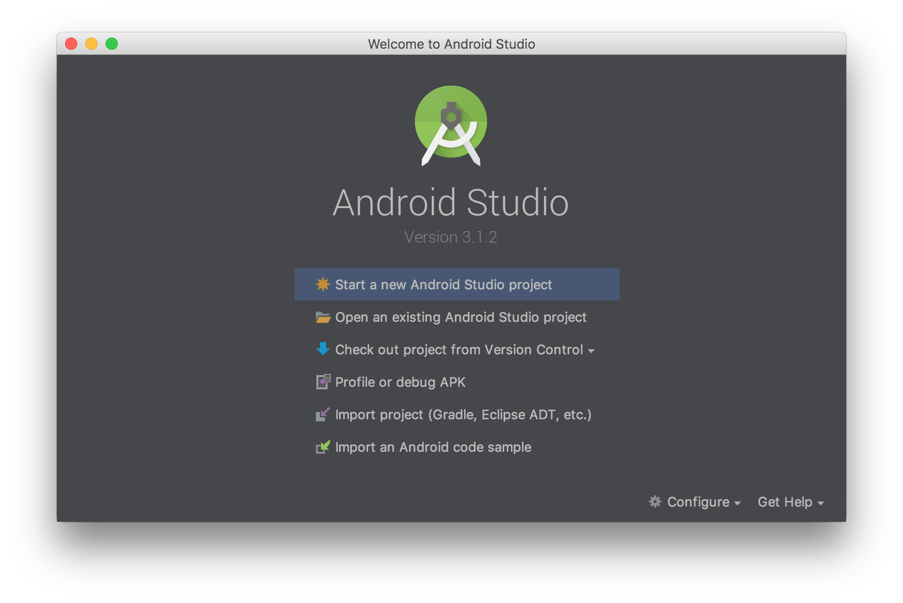
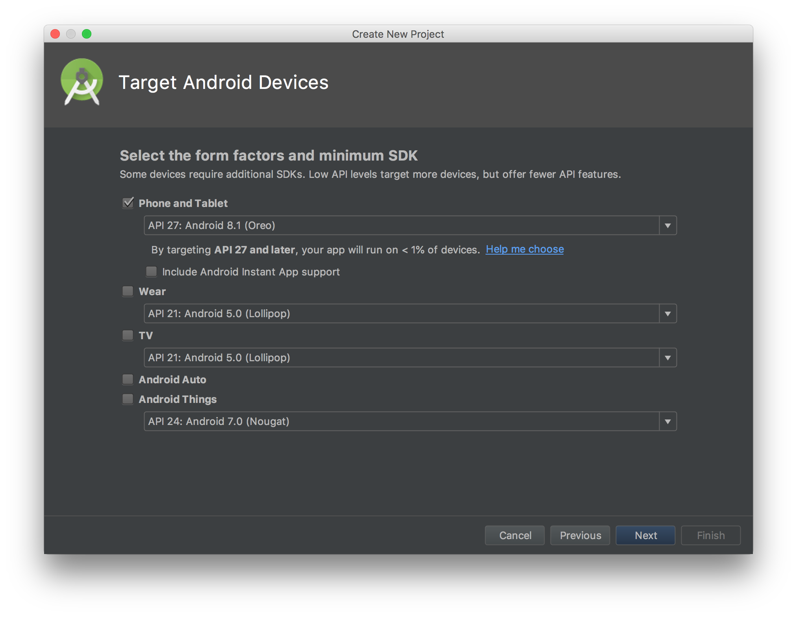
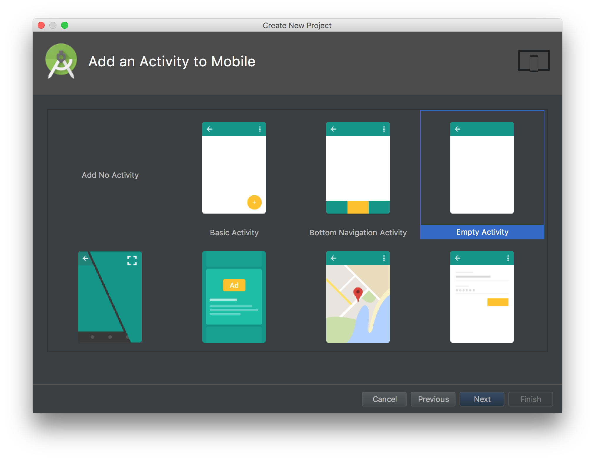
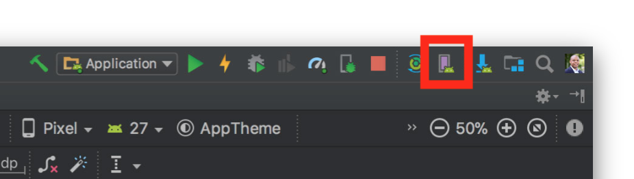
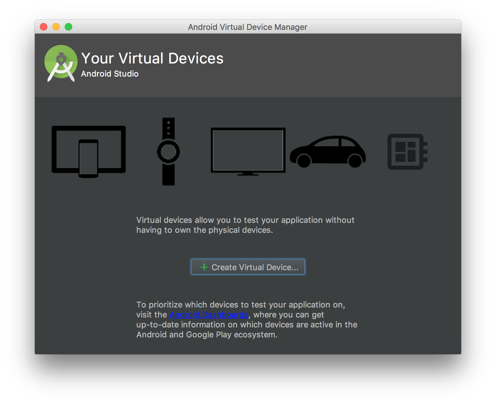
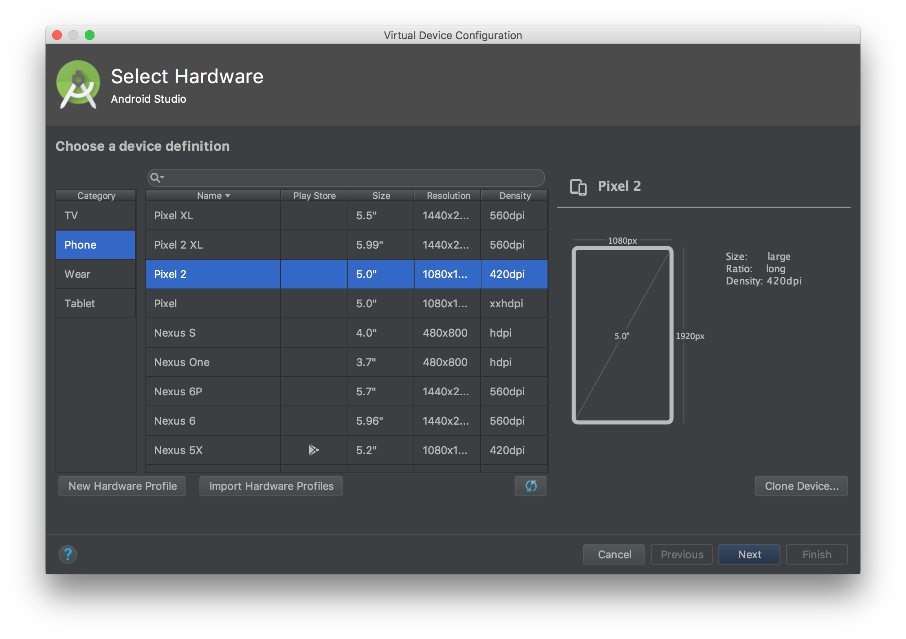
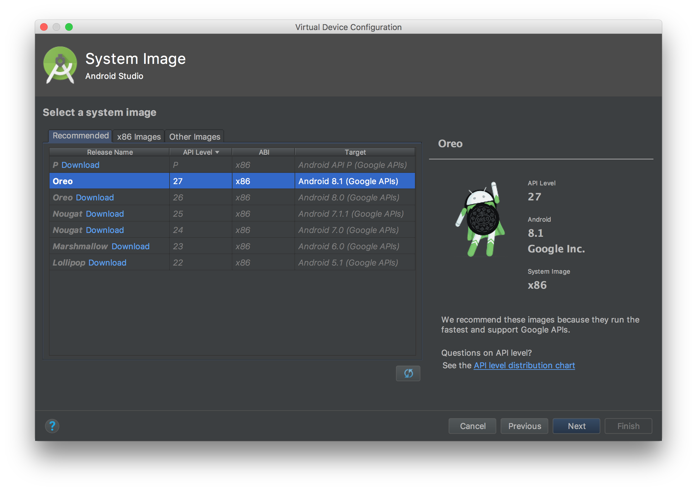
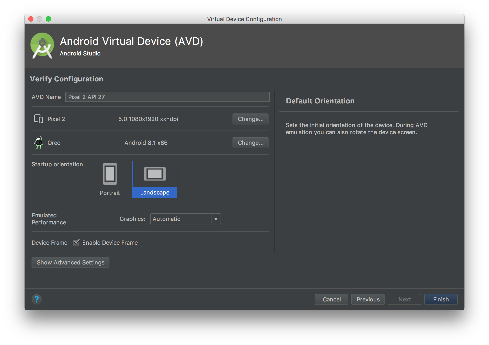

# Birdhouse
<Fill in description here>

# Contributors
## <new line for each name>
## Kyle Wodehouse
## Spicy Dan
With assistance from Daniel Sinclair 

# Necessary Development/Testing Tools

### Install Git
Download [Git](https://git-scm.com/downloads) for your computer and follow installation instructions

### Install Node.js and NPM
Download the [combined installer](https://nodejs.org/en/download/) and follow installation instructions

# Development Environment

### Install Visual Studio Code
1. Download the [VSCode app](https://code.visualstudio.com/download) from Microsoft
2. Open your code repository (folder) with File → Open
3. Use the Integrated Terminal for commands (like starting the app) instead of Command Line or Terminal (View → Integrated Terminal)

# How to Run on Android Emulator

### Install Android Studio
1. Download the [installer](https://developer.android.com/studio/)
2. Follow installation instructions
3. Run Android Studio
4. Start a New Project

5. Press Next
6. Select Phone & Tablet and Android 8.1 (Oreo)

7. Select Empty Activity

8. Press Finish
9. Open AVD Manager

10. Create a Virtual Device

11. Select the Pixel 2

12. Download & Select Android 8.1

13. Change to Landscape

14. Finish
15. In AVD Manager, double click the new virtual device to launch it

Before you run the app each session, you'll need to launch the Android Emulator that you created

### Clone this repo
1. Launch Command Prompt
2. Download the repo: `git clone https://github.com/GM-Coding-Club/birdhouse.git`
3. Change to its directory: `cd birdhouse`
4. Download dependencies `npm install`

### Setup Development Environment
1. In Android Studio, open Preferences → Appearance & Behavior → System Settings → Android SDK
2. Copy the Android SDK Location field
3. In your repo, open the file at `android/local.properties` in a text editor
4. Paste the SDK Location in place of the placeholder
5. Save the file

# How to Run on Android Devices

### Ensure correct development environment
1. Make sure you followed Steps XY in Install Android Studio

### Enabled Development Mode on the Device
1. Open the Settings app
2. Tap About
3. Tap the Build number row at the bottom seven times
4. Go back, and select Developer options
5. Enable "USB debugging"

### See if your device is visible
1. Plug your device into your computer
2. Run `adb devices` in Command Line or the Integrated Terminal
3. If you see the word `device` on the right side, you're good to go

### Start the app
Use `npm run android` in the repo directory
